# 🏎️  /🏁 F1 Season Analytics (Streamlit App)

This project is an **interactive Formula 1 analytics dashboard** built with **Streamlit**, **pandas**, and **matplotlib/seaborn**.  
It uses the [Ergast/Jolpi F1 API](http://ergast.com/mrd/) to  race, qualifying, and sprint results, then provides **visual insights** into drivers’ and constructors’ performance.

---

##  Features

- 📊 **Standings (Drivers & Constructors)**
  - Official vs. computed points (race + sprint)
  - Extra metrics: podiums, pole positions, wins
  - Clean tables without technical IDs
    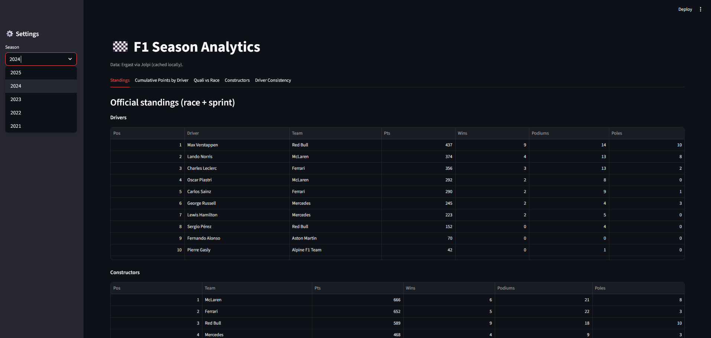
- 📈 **Cumulative Points**
  - Interactive line chart of drivers’ cumulative points
  - User selects which drivers to display
    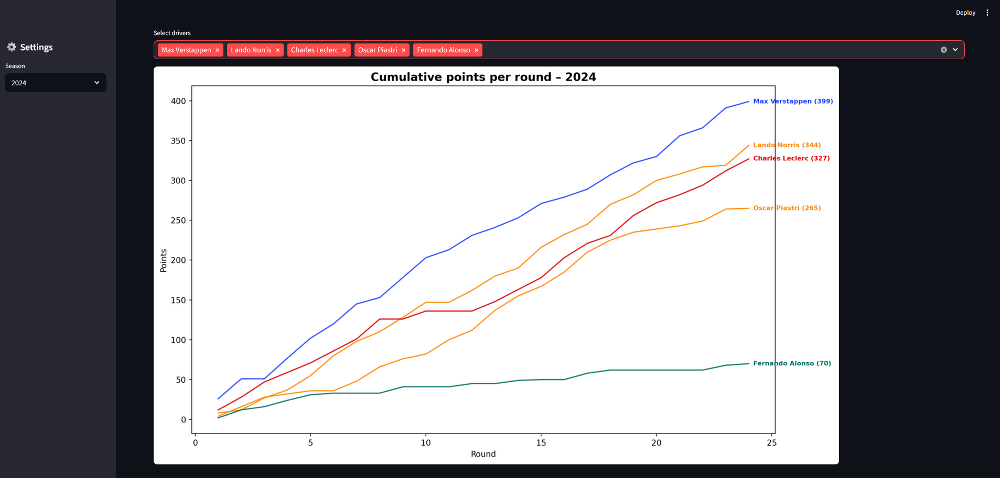
- 🎯 **Result Qualifying vs. Race**
  - Scatter plot of average quali vs. race positions
  - Team-based colors, diagonal reference line
  - Shows who gains/loses places on Sundays
    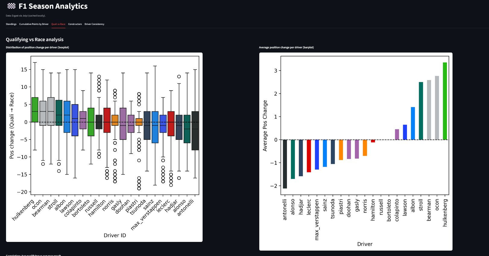    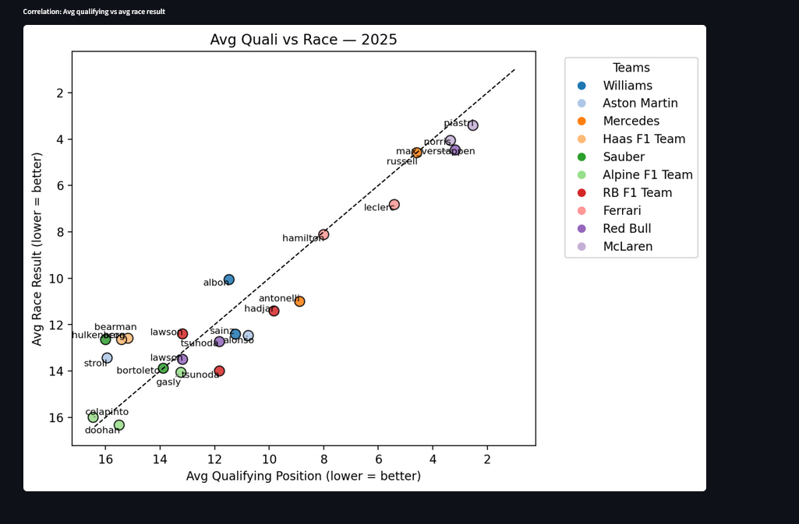
- 🏗️ **Constructors**
  - Stacked bars of points contribution per driver
  - Pie chart of constructors’ points share
    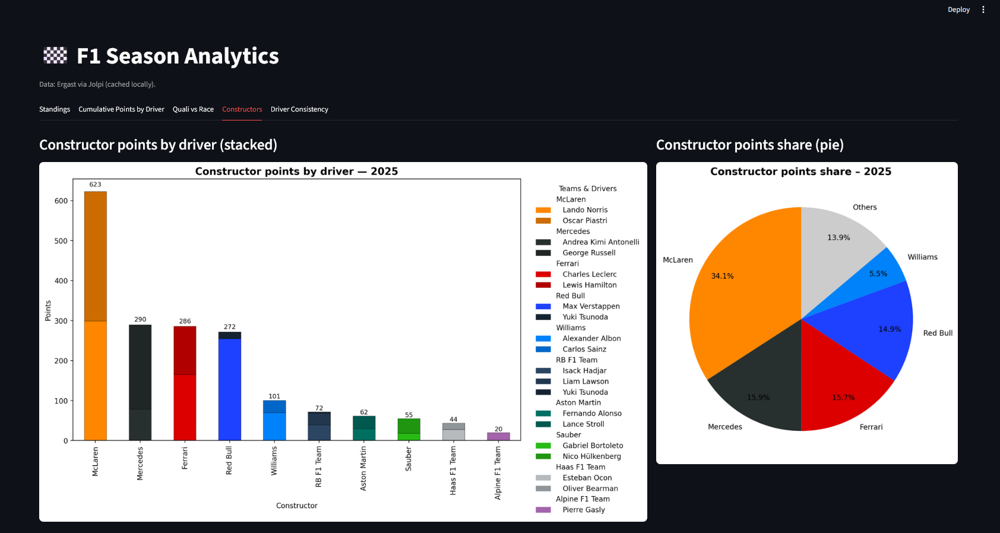

- 🏆 **Consistency**
  - Side-by-side boxplots of qualifying & race results
  - Shows performance variability per driver
    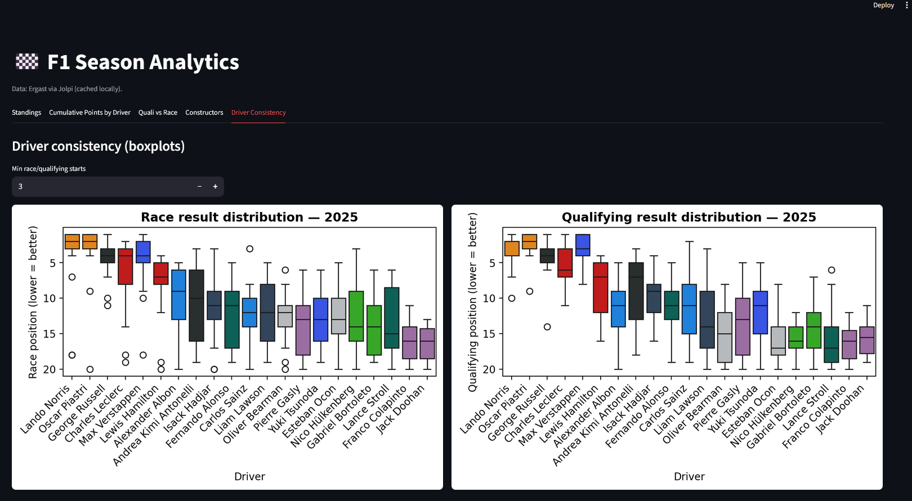

- ⏱️ **Session Analysis**
  - Standing of the session, with rank and best lap time
    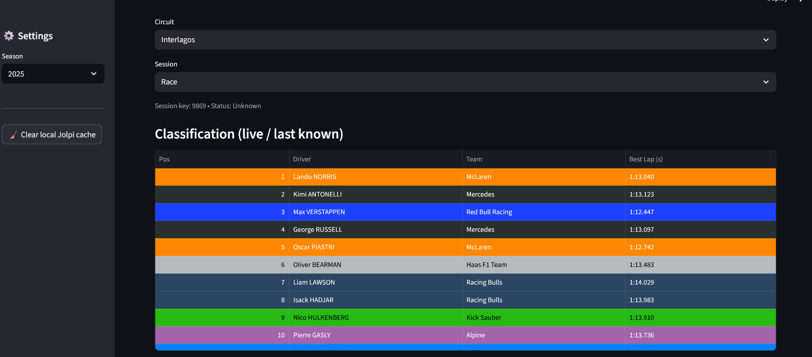
  - Labs analysis per driver
    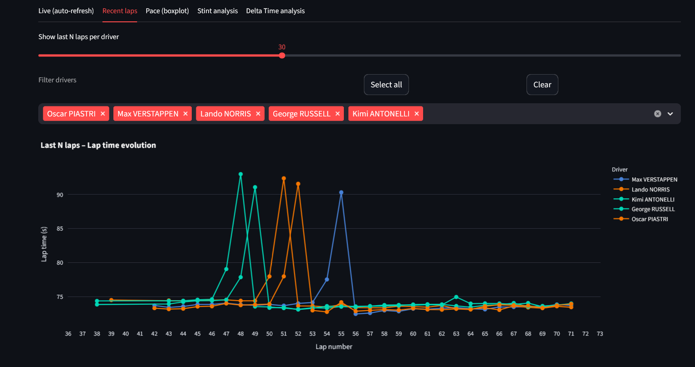
  - Stint analysis with pit stop annotations
    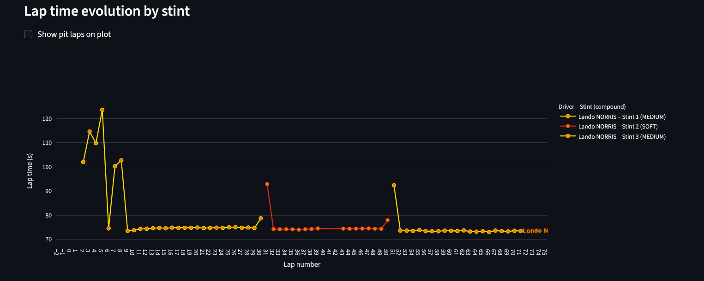
  - Lap time delta analysis vs. a reference driver
    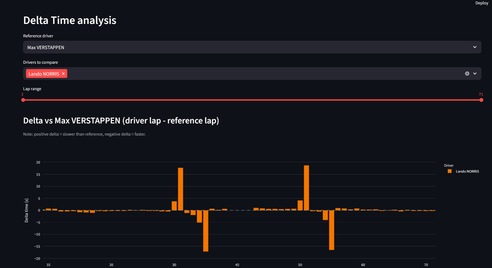  
- 🏎️ **Current driver form**: Selection of a period and drivers
 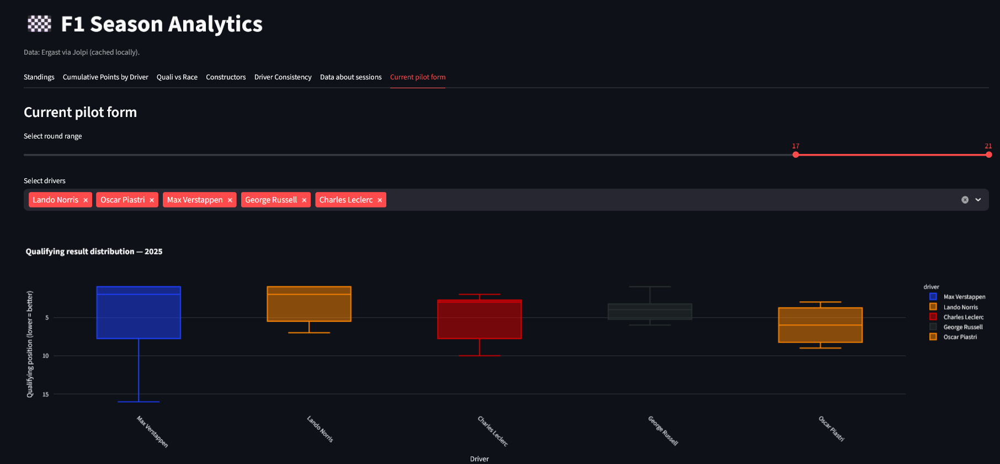
  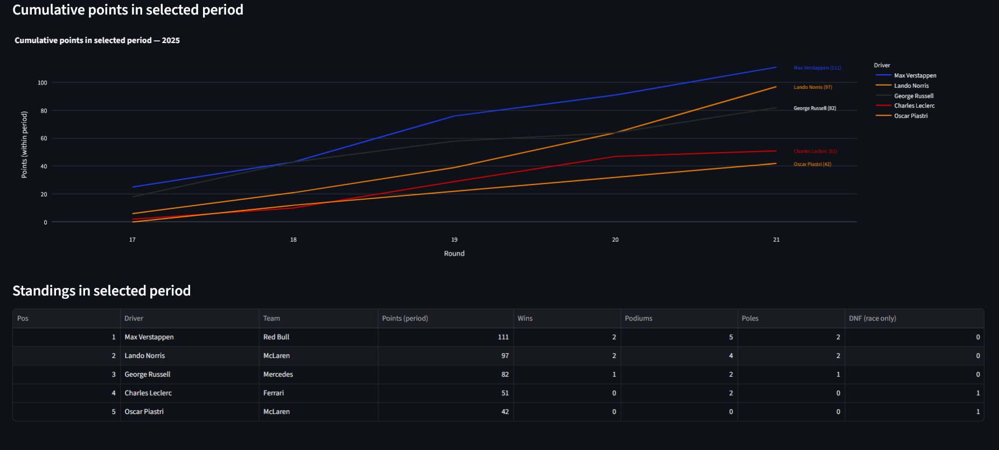
---

## 🛠️ Installation

Clone the repository:

```bash
git clone https://github.com/YOUR-USERNAME/f1-season-analytics.git
cd f1-season-analytics
